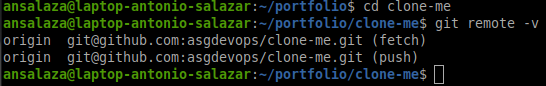

<div id='03-creating-repositories'/>

# 3. Creating repositories

<div id='31-creating-a-repo'/>

## Creating a new **local** repository

1. Go to the working directory.

    ```bash
    mkdir -p $HOME/git/labs/project1
    cd $HOME/git/labs/project1
    ```

2. Initialize Git.

    ```bash
    git init
    ```

    _You may modify the `master` branch to `main`_

    ```bash
    git branch -m main
    ```

3. Feed the Git database
- Create a new file or modify an existing one.

    ```bash
    echo "This is the git first file" > first.txt
    ```

- Add the changes to the Staging Area.

    ```bash
    git add first.txt
    ```
  _The command **git add .** (dot), `git add .` adds any files or directories._

- Commit the changes.

    ```bash
    git commit -m 'Initial commit'
    ```

  _Comment with argument `-m` the changes being commited._

4. Review the changes log.

    ```bash
    git log
    ```

<br />

<div id='32-cloning-a-repo'/>

## Cloning an existing repository

Git cloning allow you to get access to distributed respositories set up in [GirHub](https://github.com/).

### Steps
1. Go to the [asgdevops/clone-me](https://github.com/asgdevops/clone-me) **github** repository.

2. Take the git repository name from the SSH code `git@github.com:asgdevops/clone-me.git` tab.

    

3. In your local machine open a new ssh terminal and go to the directory where you would like to drop the cloned repository.


    ```bash
    cd $HOME/portfolio
    ```

4. Issue the `git clone` repository command.

    ```bash
    git clone git@github.com:asgdevops/clone-me.git
    ```
    
    

5. Get in the cloned directory.

    ```bash
    cd clone-me
    ```

6. Verify the cloned directory is configured properly.

    ```bash
    git remote -v
    ```

    

<br/>

# Hands-on labs
- [Creating a repository](labs/lab_03_creating_a_repository.md)
- [Cloning a repository](labs/lab_04_cloning_a_repository.md)


# :books: References
- [Git Reference](https://git-scm.com/docs)


<br />

:arrow_backward: [back to index](README.md#00-toc)
