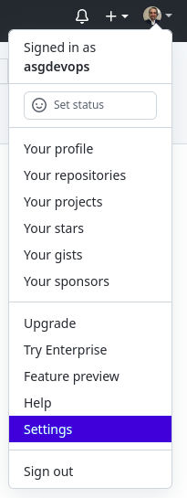
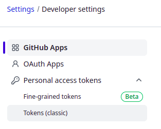
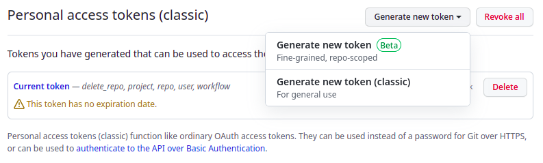
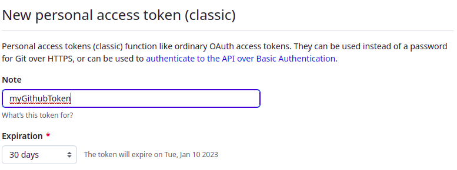
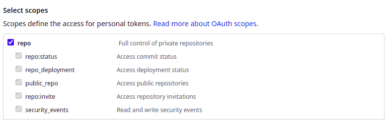
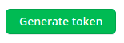
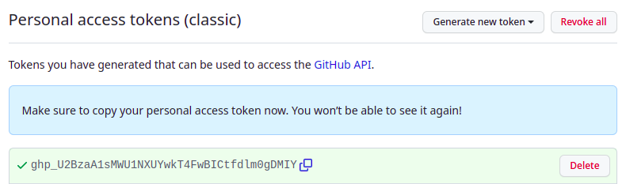

# 5. Creating a personal access token

GitHub Personal Access Token is an authentication method meant to be non-interactive. As a result, it could be used by any Application Interface (API).

### Steps
1. Go to [GitHub](https://github.com)

2. Open the personal account main menu and select the **Settings** option.

    

3. In the Personal Account settings screen scroll down and click on **Developer Settings** option.

    

4. Open the **Personal access tokens** drop down menu and click on **Tokens (classic)**.
    
    

5. Select the **Generate new token (classic)** option.

    

6. Add a **Note** to tag the token.

    

7. Choose the token **expiration** and **scopes**.

    

8. Click on the `Generate token` button.

    

9. Save the token created by GitHub for future use.

    _If the token is lost, you will have to create a new one._

    

 

# Hands-on labs

- [Create a personal access token](labs/lab_05_create_a_token.md)

# :books: References

- [GitHub Docs - Create a personal access token](https://docs.github.com/en/authentication/keeping-your-account-and-data-secure/creating-a-personal-access-token)

 

:arrow_backward: [back to index](README.md#00-toc)
