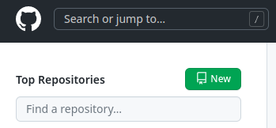
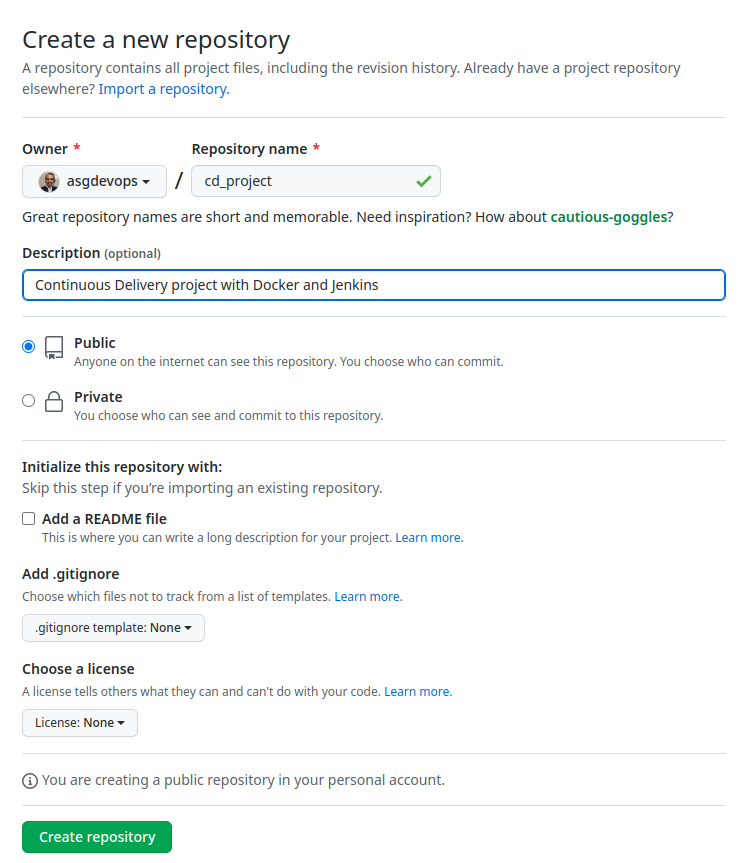
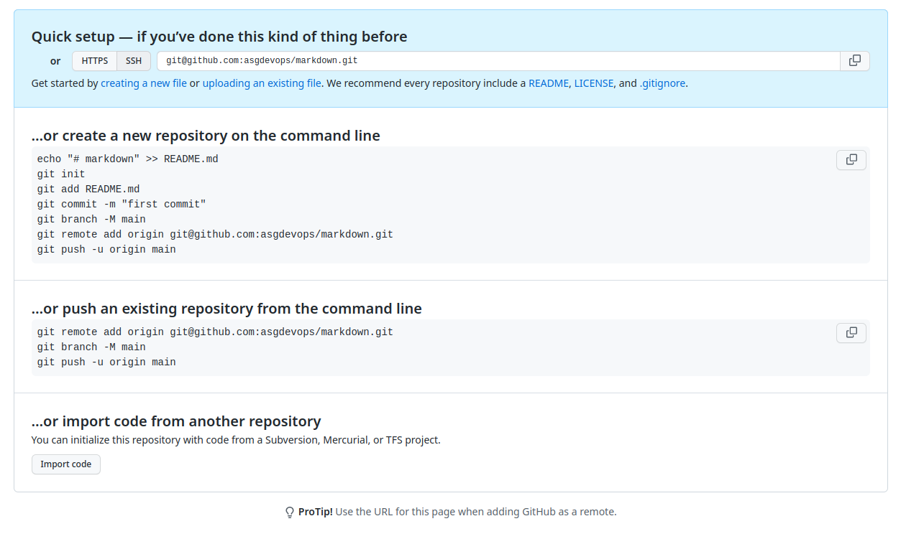

<div id='06-creating-repositories'/>

# 6. Creating repositories

<div id='61-creating-a-remote-repo'/>

## Create a new repository in **GitHub** (_remote repository_)

1. Go to [GitHub](https://github.com/) and sign in.

2. On the **Top Repositories** section click on the **New** button.

    

3. Type the **Repository name**, **Description**, whether it is **Public** or **Private**, if you would like to add a **README** or **.gitignore** files.

    

4. Click on the **Create repository** button.

    

<div id='62-creating-a-local-repo'/>

## Creating a repository in Git (_local repository_)

1. Go to the working directory.

    ```bash
    mkdir -p $HOME/portfolio/markdown
    cd $HOME/portfolio/markdown
    ```

2. Initialize Git.

    ```bash
    git init
    ```

3. Rename the 
    ```bash
    git branch -m main
    ```

3. Create the first version of `README.md` file.
   

    ```md
    # Markdown Guide
    What is Markdown?
    Purpose of using MD.
    
    # Markdown syntax
    ## Headers
    
    ## Text formats
    - Simple text. 
    - Bold text.
    - Itallic text. 
    - Strikedtrhough text. 
    - Quotations.
    - Important workds.
    - Subscript.
    - Superscript.

    ## Lists
    - Ordered lists 
    - Unordered lists
    - Task lists

    ## Tables and horizontal rules
    ## Links
    ## Images and Emoji

    ## Foot notes

    # References
    ## Markdown eidtors
    ```

4. Review the <span style="color:red">**Working Directory**</span> status.

    ```bash
    git status
    ```

5. Add the changes to the <span style="color:green">**Staging Area**</span>.

    ```bash
    git add README.md
    ```
 
    _The command **git add .** (dot), `git add .` adds any files or directories._

6. Save the changes to the <span style="color:gold">Git database</span>.

    ```bash
    git commit -m 'Initial commit'
    ```

    _Use `-m` to add comments to the changes._

7. Verify the changes log.

    ```bash
    git log
    ```

<br />


# Hands-on labs
- [Creating a repository](labs/lab_03_creating_a_repository.md)

# :books: References
- [Git Reference](https://git-scm.com/docs)


<br />

:arrow_backward: [back to index](README.md#00-toc)
