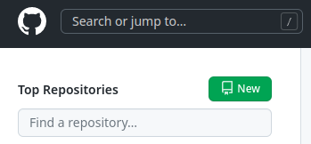
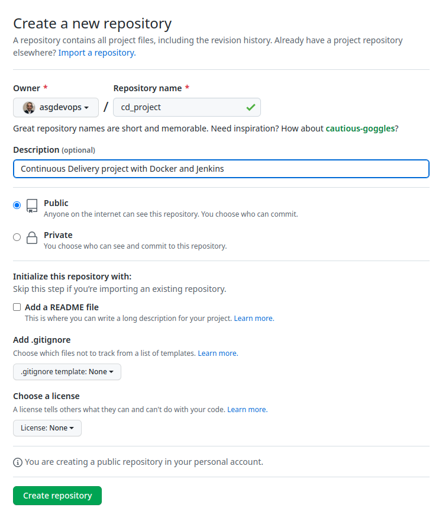
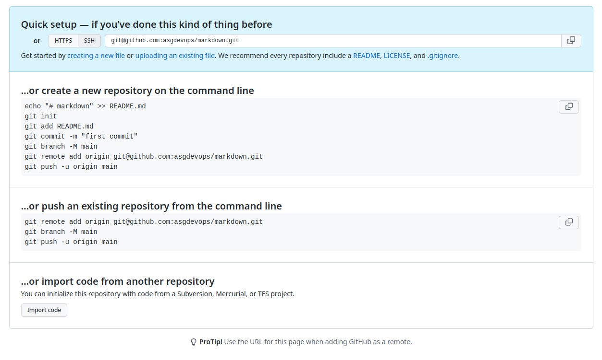

<div id='06-creating-repositories'/>

# 6. Creating repositories

<div id='61-creating-a-remote-repo'/>

## Create a new repository in **GitHub** (_remote repository_)

1. Go to [GitHub](https://github.com/) and sign in.

2. On the **Top Repositories** section click on the **New** button.

    

3. Type the **Repository name**, **Description**, whether it is **Public** or **Private**, if you would like to add a **README** or **.gitignore** files.

    

4. Click on the **Create repository** button.

    

<div id='62-creating-a-local-repo'/>

## Creating a repository in Git (_local repository_)

1. Go to the working directory.

    ```bash
    mkdir -p $HOME/git/labs/project1
    cd $HOME/git/labs/project1
    ```

2. Initialize Git.

    ```bash
    git init
    ```

    _You may modify the `master` branch to `main`_

    ```bash
    git branch -m main
    ```

3. Feed the Git database
- Create a new file or modify an existing one.

    ```bash
    echo "This is the git first file" > first.txt
    ```

- Add the changes to the Staging Area.

    ```bash
    git add first.txt
    ```
  _The command **git add .** (dot), `git add .` adds any files or directories._

- Commit the changes.

    ```bash
    git commit -m 'Initial commit'
    ```

  _Comment with argument `-m` the changes being commited._

4. Review the changes log.

    ```bash
    git log
    ```

<br />


# Hands-on labs
- [Creating a repository](labs/lab_03_creating_a_repository.md)
- [Cloning a repository](labs/lab_04_cloning_a_repository.md)

# :books: References
- [Git Reference](https://git-scm.com/docs)


<br />

:arrow_backward: [back to index](README.md#00-toc)
