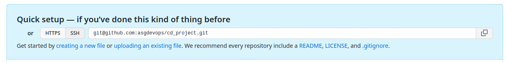
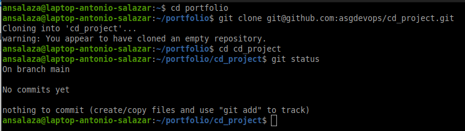
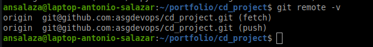

# 7. Clone a repository

Git cloning allows you to get access to distributed respositories set up in [GirHub](https://github.com/).

### Steps
1. Go to the [GitHub]([GirHub](https://github.com/)) repository you want to clone. (_in this example **cd_project** repository_)


2. Take the git repository name from the SSH code `git@github.com:asgdevops/clone-me.git` tab.

    

3. In your local machine open a new ssh terminal and go to the directory where you would like to drop the cloned repository.


    ```bash
    cd $HOME/portfolio
    ```

4. Issue the `git clone` repository command.

    ```bash
    git clone git@github.com:asgdevops/cd_project.git
    ```

5. Get in the cloned directory.

    ```bash
    cd cd_project
    ```

    

6. Verify the cloned directory is configured properly.

    ```bash
    git remote -v
    ```

    

<br/>

# Hands-on labs

- [Cloning a repository](labs/lab_04_cloning_a_repository.md)

# :books: References

- [Git Reference](https://git-scm.com/docs)

<br />

:arrow_backward: [back to index](README.md#00-toc)
