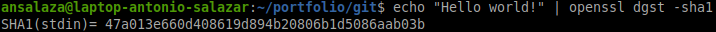
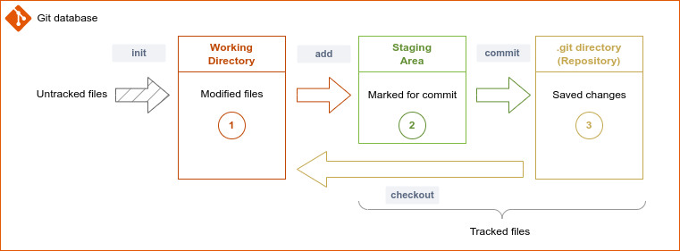
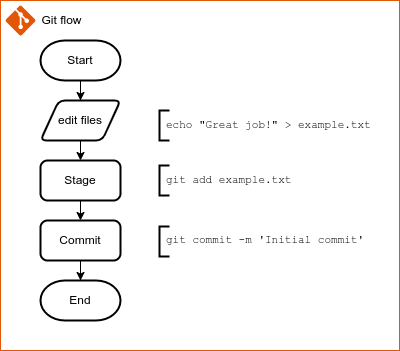

# :book: About Git

## Version control system

A version control system is a program that helps people to save different versions of a file or set of files. 

Some benefits of version control systems are listed below:

- Provide a historical view of who has modified specific information tracked on the system.

- Let users roll back to previous versions when something goes wrong.

- Count with a database having all of the different document versions.

- Allow multiple teams to work independently.

- Merge information when it is necessary to put teams' contributions together.


## What is Git?

Git is one of the most popular version control systems. The way it works offers huge benefits comparing other software of its kind.

It runs on any platform, Linux, macOS, and Windows.

In addition, it provides the benefit of saving information in the cloud, either privately or publicly.

## How Git Works?

Git stores versions as a series of [snapshots](https://dictionary.cambridge.org/dictionary/english/snapshot). A snapshot is a point-in-time picture of the information.

The snapshots take place when a `git commit` happens. 

Only delta is stored. 

  > _To be efficient, if files have not changed, Git doesn't store the file again, just a link to the previous identical file it has already stored._[^1]


## How delta is detected?

Any change gets detected by data integrity. Before saving the information, Git encrypts it by using a hash[^2] algorithm named SHA-1. The resulting value refers to and validates such information.

The SHA-1 string consists of 40-length hexadecimal[^3] characters. 
That string looks like `78478919cdb0edece11c15b5d3666bfc3db946d7`.

For example, the command below encrypts 'Hello world' using SHA-1.

```bash
echo "Hello world!" | openssl dgst -sha1
```

  

Git SHA-1 algorithms calculate the file contents and directory structure when saving it to its database.

## Git state tree

Git manages files and directories in three states:

|#|State|Description|Area name|
| --|--|--|--|
|1|<span style="color:red">Modified</span>|Means the file was modified but not saved in the Git database yet.|Working directory|
|2|<span style="color:green">Staged</span>|The modified file is marked to be commited the next step (_marked for review before saving it_).|Staging area|
|3|<span style="color:gold">Committed</span>|The modifications are saved to Git database.|Repository[^4]|

  
  *Diagram 1*

## Git flow

The process of adding a file or group of files to the Git database consists of three steps:
1. Editing the files and directory structure in the working area.
2. Preparing the modifications before saving them. (_Also referred as to index or stage changes._)
3. Saving the changes into Git Database.


    
    
    *Diagram 2*

# :books: References

- [Pro Git](https://git-scm.com/book/en/v2) by Scott Chacon and Ben Straub, second edition, Appress 2022.


[^1]: Scott, S., & Straub, B. (2022). _Pro Git_ (2nd ed., p. 15). Apress. [https://git-scm.com/book/en/v2](https://git-scm.com/book/en/v2)

[^2]: Hash is a method of converting one value to a different one.

[^3]: [Hexadecimal](https://techterms.com/definition/hexadecimal) is a string of characters using 0 to 9 numbers and A through F letters.

[^4]: The Git repository, also known as local repository, is saved under `$PWD/.git` directory.


<br />

:arrow_backward: [back to index](../README.md)

