# :book: 4. Recording changes in Git

> ## _Previous topics_
> - _[About Git](../documents/00_about_git.md)._
> - _[Install Git](../documents/01_installing_git.md) on your local computer._
> - _[Configure Git](../documents/02_configuring_git.md) before using it._
> - _[Create a Git repository](../documents/03_creating_a_repository_in_git.md)._

## File states in Git
Git has two states for files:
1. **Tracked**. These files exist in the staging area or the Git repository (database). 
2. **Untracked**. Files that are not staged, nor saved in the Git repository.

# Getting files tracked

## :red_circle: Tracking new files

Before any change, verify the current state of the working directory.

```bash
git status
```
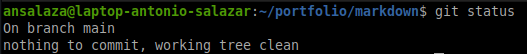

Let's create a file with your username and last update date.

```bash
echo -e "Author: $USER\nUpdated on: $(date +%Y-%m-%d)" > author.txt
cat author.txt
```

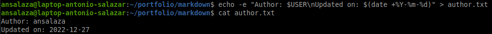


Verify the status one more time.

```bash
git status
```

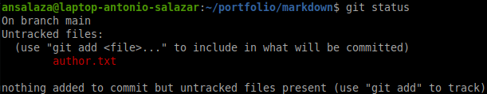


_Diagram 6 shows the current working tree._

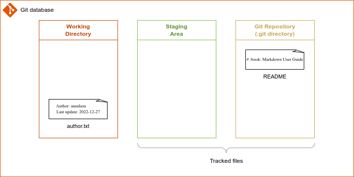
*Diagram 6*


At this point, Git has detected something has changed. In this example, there is a new file named `author.txt`. But it is still not tracked.

Two options are available now:
1. Remove the `author.txt` file so that Git returns to the last state.
2. Stage the `author.txt` file to get it tracked.

To stage the file execute the `git add` command.

```bash
git add author.txt
git status
```

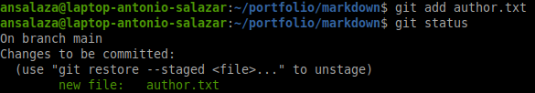

_Diagram 7 shows the current working tree._

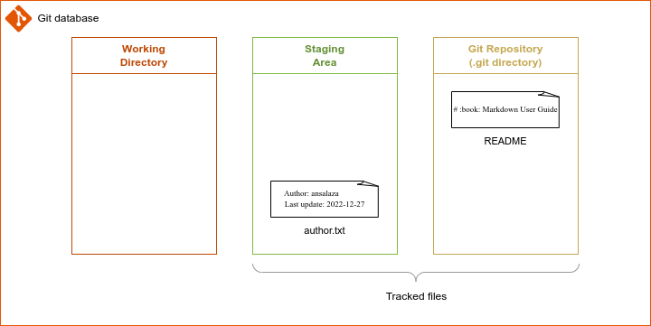
*Diagram 7: current working tree.*

Complete the process by saving the file to the Git repository

```bash
git commit -m 'Add author username and update date.'
```
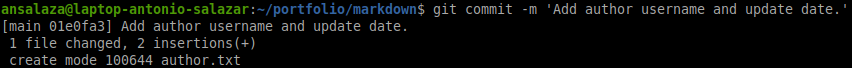

Review the status again and verify the changes log.

```bash
git status
```

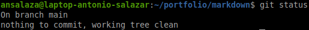


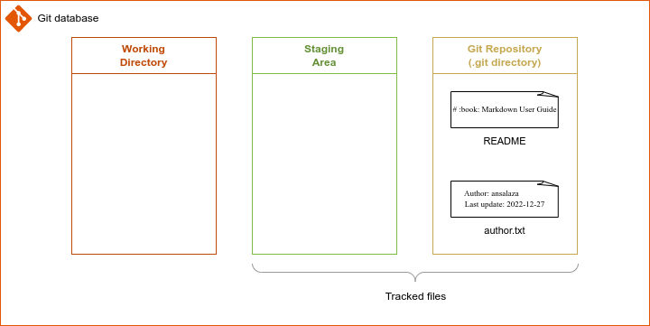
*Diagram 8: current working tree.*

Display the changes history.

```bash
git log
```

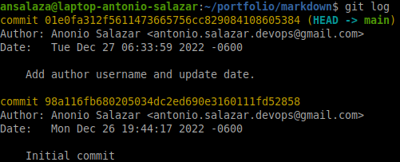

---

## :red_circle: Tracking existing files

Let's now edit the `README` file created when creating the Git repository.

This time we are adding the topics about Markdown user guide.

_Use any editor of your preference to add the following lines to the `README` file._

```md
## What is Markdown?
## What is Markdown used for?

# Markdown syntax
## Headers

## Text formats

## Lists

## Tables and horizontal rules

## Links

## Images and Emoji

## Foot notes

## Markdown eidtors

# References
```

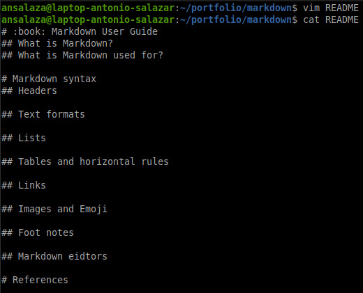

Now modify the `author.txt` file by replacing the **username** by the git config **user.name**.

```bash
NAME=`git config --get user.name`
sed "s/$USER/$NAME/g" author.txt > author.new
mv author.new author.txt
```

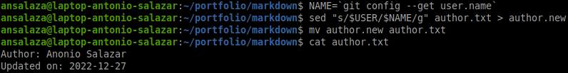

Verify the Git working tree status.

```bash
git status
```

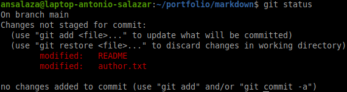

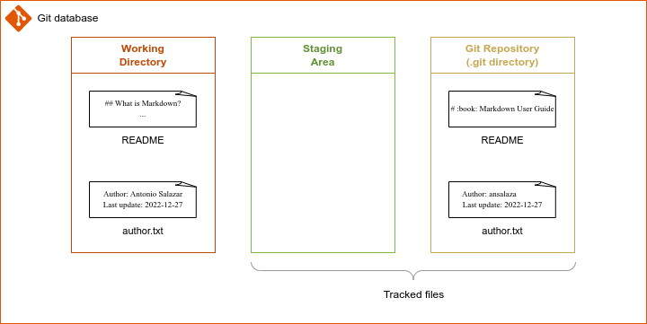
*Diagram 9: current working tree.*


Stage both files in a single command.

```bash
git add .
```

_The dot at the end means to stage every modified file or directory._

Verify the files are now staged.

```bash
git status
```

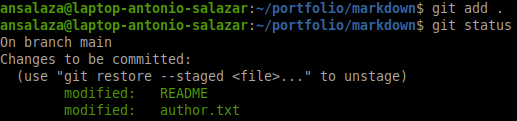

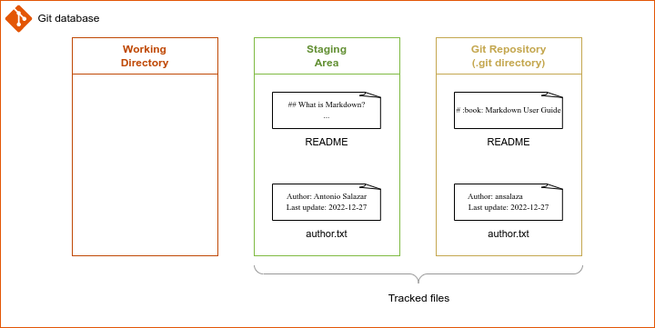
*Diagram 10: Current working tree.*


Feed up the working tree with a new version of `author.txt` file by adding your email address.

```bash
EMAIL=`git config --get user.email`
echo $EMAIL
echo $EMAIL >> author.txt
cat author.txt
```

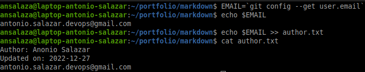

View the current status.

```bash
git status
```

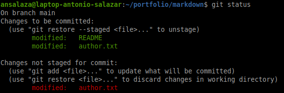

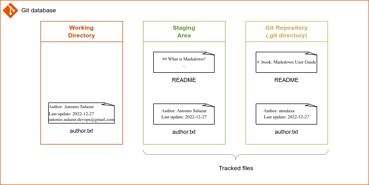

*Diagram 11: Current working tree.*

---

## :red_circle: Comparing deltas in the Git Wokring Tree

As you can see, Git's working tree has different file versions in every stage, so how to identify the differences between them?

Fortunately, Git has the `git diff` command to identify deltas.

Command | Description 
--|--
`git diff`| Compares files on the <span style="color:green">Staging Area</span> against the files on the <span style="color:red">Working Directory</span>. 
`git diff --staged` </br>or</br>`git diff --cached`| Compares files on the <span style="color:gold">Git Repository</span> against the files on the <span style="color:green">Staging Area</span>. 

</br>

### Example 1: Comparing the <span style="color:green">Staging Area</span> against the <span style="color:red">Working Directory</span>. 

Issue the `git diff` command without arguments.

```bash
git diff
```

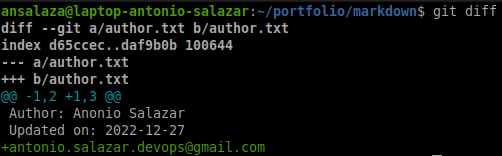

Below is the output meaning.

Line No.| Output | Meaning
--|--|--
1|`diff --git a/author.txt b/author.txt`| Git is comparing version **A** against **B** of the `author.txt` file. </br>**A** refers to the `author.txt` file in the <span style="color:green">Staging Area</span>, whereas **B** refers to the `author.txt` file in the <span style="color:red">Working Directory</span>.
2|`index d65ccec..daf9b0b 100644`| The hash values of **A** and **B** followed by the regular file code (100644) after. 
3|`--- a/author.txt`| The `---` sign identifies the **A** version of the `author.txt` file in the <span style="color:green">Staging Area</span>.
4|`+++ b/author.txt`| The `+++` sign identifies the **B** version of the `author.txt` file in the <span style="color:red">Working Directory</span>.
5|`@@ -1,2 +1,3 @@`| Affected lines range by the comparison between **A** and **B**. </br>For example: `@@ -1,2` means the **A** lines range from 1 to 2, whereas ` +1,3 @@` means the **B** lines range from 1 to 3.
6|`Author: Anonio Salazar`| Line contents without change.
7|`Updated on: 2022-12-27`| Line contents without change.
8|`+antonio.salazar.devops@gmail.com`| The `+` sign right before `antonio.salazar.devops@gmail.com` means we are adding new content.

In conclusion, we can infer the `author.txt` file in the <span style="color:red">Working Directory</span> has additional content `antonio.salazar.devops@gmail.com` in line 3.

</br>

### Example 2: Delta between the <span style="color:gold">Git Repository</span> and the <span style="color:green">Staging Area</span>. 

Now run the `git diff --staged` or the `git diff --cached` command.

```bash
git diff --staged
```

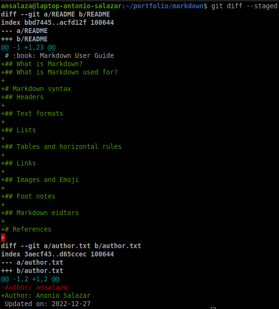


Let's analyze the output meaning.

Line No.| Output | Meaning
--|--|--
1|`diff --git a/README b/README`|Git is comparing version **A** against **B** of the `README` file. </br>**A** refers to the `README` file in the <span style="color:gold">Git Repository</span>, whereas **B** refers to the `README` file in the <span style="color:green">Staging Area</span>.
2|`index bbd7445..acfd12f 100644`| Git metadata, hash values of **A** and **B** followed by the regular file code (100644) after.
3|`--- a/README`|The `---` sign identifies the **A** version of the `README` file in the <span style="color:gold">Git Repository</span>.
4|`+++ b/README`|The `-+++` sign identifies the **B** version of the `README` file in the <span style="color:green">Staging Area</span>.
5|`@@ -1 +1,23 @@`|Affected lines range by the comparison between **A** and **B**. </br>For example: `@@ -1` means the **A** lines range from 1 to 1, whereas ` +1,23 @@` means the **B** lines range from 1 to 23.
6|`# :book: Markdown User Guide`|Line contents without change.
7|`+## What is Markdown?`| The `+` sign before line contents means addition. So, adding new content.
8|`+## What is Markdown used for?`|New content.
9|`+`|New content. (_blank line_)
10|`+# Markdown syntax`|New content.
11|`+## Headers`|New content.
12|`+`|New content.
13|`+## Text formats`|New content.
14|`+`|New content.
15|`+## Lists`|New content.
16|`+`|New content.
17|`+## Tables and horizontal rules`|New content.
18|`+`|New content.
19|`+## Links`|New content.
20|`+`|New content.
21|`+## Images and Emoji`|New content.
22|`+`|New content.
23|`+## Foot notes`|New content.
24|`+`|New content.
25|`+## Markdown eidtors`|New content.
26|`+`|New content.
27|`+# References`|New content.
28|`+`|New content.
29|`diff --git a/author.txt b/author.txt`| Comparison between **A** and **B** of the `author.txt` file. </br>**A** is the `author.txt` file in the <span style="color:gold">Git Repository</span> and, **B** is the `author.txt` file in the <span style="color:green">Staging Area</span>.
30|`index 3aecf43..d65ccec 100644`| Metadata hash values of **A** and **B** regular files. 
31|`--- a/author.txt`| **A** version of the `author.txt` file in the <span style="color:gold">Git Repository</span>.
32|`+++ b/author.txt`| **B** version of the `author.txt` file in the <span style="color:green">Staging Area</span>.
33|`@@ -1,2 +1,2 @@`| Affected lines range by of **A** and **B** accordingly. Both **A** and **B** lines range is from 1 to 2.
34|`-Author: ansalaza`| The `-` sign before the contents `Author: ansalaza` means this information is being removed.
35|`+Author: Anonio Salazar`| The `+` sign before contents `+Author: Anonio Salazar` means this information is added.
36|`Updated on: 2022-12-27`| Line contents without change.

In conclusion, we can deduce the facts below:
- Two files get compared in sequence order: the first is the `README` file, and the second is the `author.txt` one.
- The file version comparison is between the <span style="color:gold">Git Repository</span> against the <span style="color:green">Staging Area</span>.
- The `README` file in the <span style="color:green">Staging Area</span> has 22 new lines.
- The `author.txt` file in the <span style="color:green">Staging Area</span> is replacing `ansalaza` with `Antonio Salazar` as the Author's name.
 
---

## :red_circle: Comparing deltas in the Git Repository

Before comparing the Git Repository differences, let's conclude saving the pending documents being edited.

First we are staging the latest version of `author.txt` file.

```bash
git status
git add author.txt
git status
```

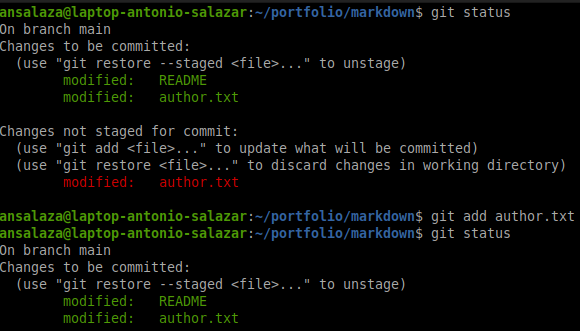


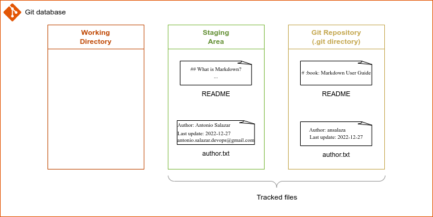
*Diagram 12: Current working tree.*

After that, let us execute a commit statement to whatever is in the Staging Area. In this case, the `README` and `author.txt` files.

This time, we provide more details using the `git commit -a` command, which opens a new text editor like vi to submit our comments.

```bash
git commit -a # hit enter
```

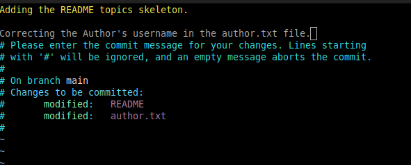

Edit the comments and save them.

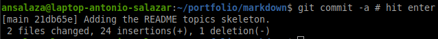


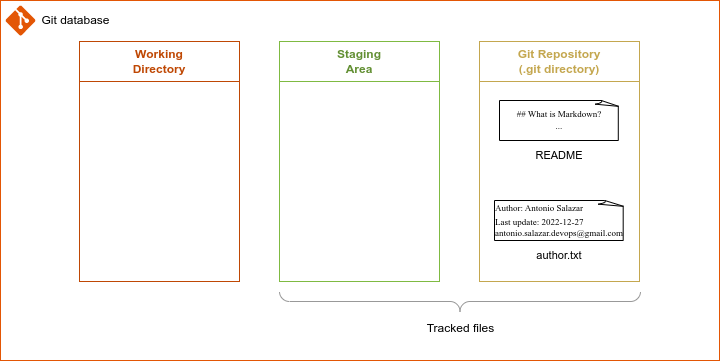
*Diagram 13: Current working tree.*


Check the Git Repository log.

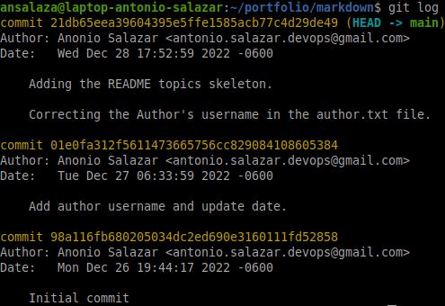

Compare the differences between a previous commit and the last one.

The syntax is
`git diff <hash value of the commit A> <hash value of the commit B>`

Depending on the order you choose are the comparison results.

Going backward, the example below compares the second commit against the third one, which is the last one. (HEAD vs. HEAD~1)

```bash
git diff 01e0fa312f5611473665756cc829084108605384 21db65eea39604395e5ffe1585acb77c4d29de49
```

_Notice you get the same feedback when using the first six characters of each hash value._

```bash
git diff 01e0fa 21db65
```

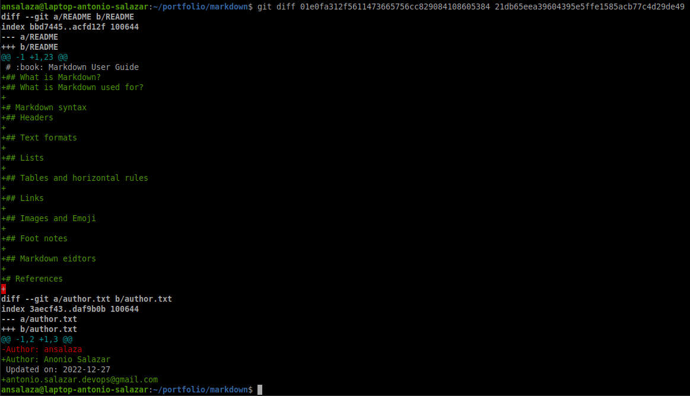


The output shows new lines are appended to the `README` file (22 in this case).
Also, a new email address was added and, the author's name was replaced in the `author.txt` file.

The example below compares the initial commit agains the second one.

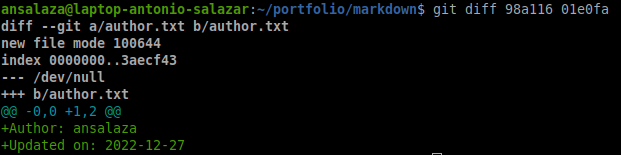

In this example, the feedback shows the file named `author.txt` was created. It also shows its contents.


<br />

# :alembic: Practice lab

The objective is to continue to build the markdown user guide, started in the previous chapter.

- [Record Changes in Git](../labs/lab_04_recording_changes.md)

# :books: References
- [Git Basics - Recording Changes to the Repository](https://git-scm.com/book/en/v2/Git-Basics-Recording-Changes-to-the-Repository)


<br />

:arrow_backward: [back to index](../README)
