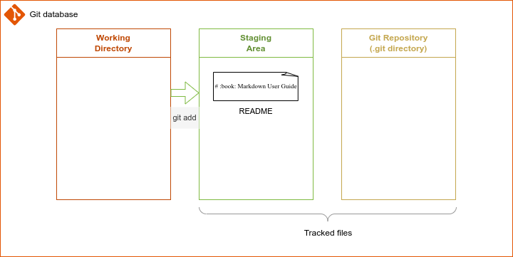
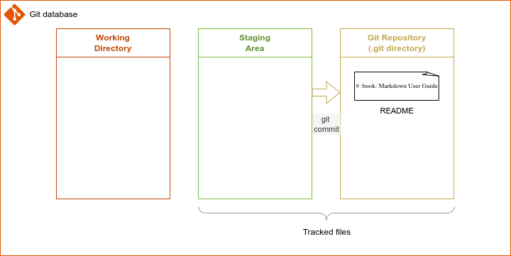

# :book: 5. File Operations in Git

> ## _Previous topics_
> - _[About Git](../documents/00_about_git.md)._
> - _[Install Git](../documents/01_installing_git.md) on your local computer._
> - _[Configure Git](../documents/02_configuring_git.md) before using it._
> - _[Create a Git repository](../documents/03_creating_a_repository_in_git.md)._
> - _[Recording changes in Git](../documents/04_recording_changes.md)._

## Moving files

## Removing files

## Ignoring files

## Skipping the staging area

## Repositoy creation options

There are two options for creating repositories in Git:
1. Create a **local** repository.
2. Clone a **remote** repository from [GitHub](https://github.com/).

## Local repository

The local repository is the Git database, where the metadata gets stored. Git creates the `$PWD/.git` directory to keep its database. In this case, `$PWD` means the current working directory.

## Remote repository

Git offers the possibility to distribute the repositories across the Internet. A powerful feature this option gives is the capability of having a group of people contributing to the same [GitHub](https://github.com/) repository keeping the data integrity.

Remote repositories require creating an account in [GitHub](https://github.com/) and will be covered later.


## Creating a **local** repository in Git 

1. Go to the working directory.

    ```bash
    mkdir -p $HOME/portfolio/markdown
    cd $HOME/portfolio/markdown
    ```

    > This example creates a new repository to initialize Git. However, you could use an existing repository.
    
2. Initialize Git.

    ```bash
    git init
    ```

3. Create the first version of `README` file.

    ```bash
    echo "# :book: Markdown User Guide" > README
    cat README
    ```

    The following diagram shows the status of Git working tree.

    
    *Diagram 3*

4. Review the <span style="color:red">**Working Directory**</span> status.

    ```bash
    git status
    ```

5. Add the changes to the <span style="color:green">**Staging Area**</span>.

    ```bash
    git add README
    ```
 
    _The command **git add .** (dot), `git add .` adds multiple files or directories in a single pace._

    Now the status of Git working tree looks like.

    
    *Diagram 4*

6. Save the changes to the <span style="color:gold">Git database</span>.

    ```bash
    git commit -m 'Initial commit'
    ```

    _Use `-m` to add comments to the changes[^1]._

    
    
    *Diagram 5*

7. Verify the changes log.

    ```bash
    git log
    ```


# :books: References
- [Git Basics - Getting a Git Repository](https://git-scm.com/book/en/v2/Git-Basics-Getting-a-Git-Repository) 
 
<br />

:arrow_backward: [back to index](../README.md)

[^1]: As a good practice, add clear and specific comments anytime changes happen. Consider other people who could contribute to the work you have done already and want to understand, in detail, what kind of changes they are managing.

