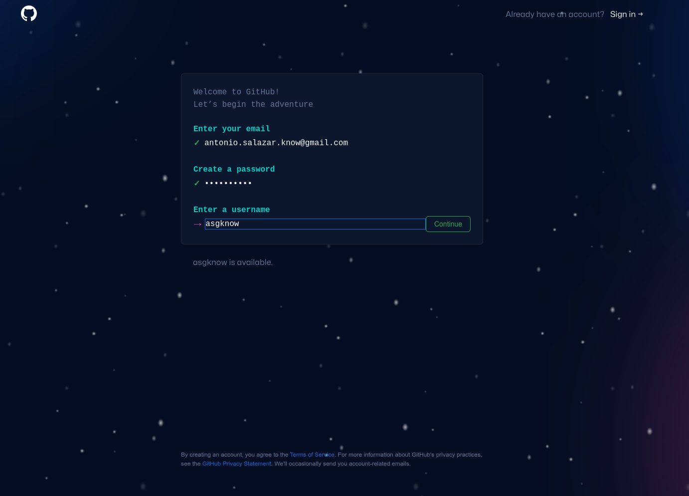

# :book: 6. Sign up for a new GitHub Account

# Steps
1. Go to [GitHub](https://github.com/ ) and click on the **Sign up** button.

  

2. Type your **email** and **password**.

  

3. Enter your new **username**

  

4. Reply whether you would like to get emails from GitHub or not.

  

5. Verify your account.

  

6. Confirmation from GitHub.

  

7. Specify your team members if any.

  

8. Select the Tools to be used with GitHub.

  

9. Choose the license type.

  

10. Youare now set.

  

 

# :books: References
- [Signing up for a new GitHub account](https://docs.github.com/en/get-started/signing-up-for-github/signing-up-for-a-new-github-account)

 

:arrow_backward: [back to index](../README.md)
