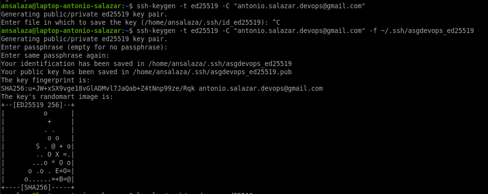
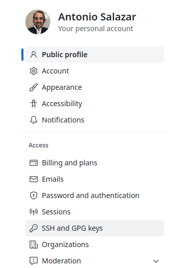
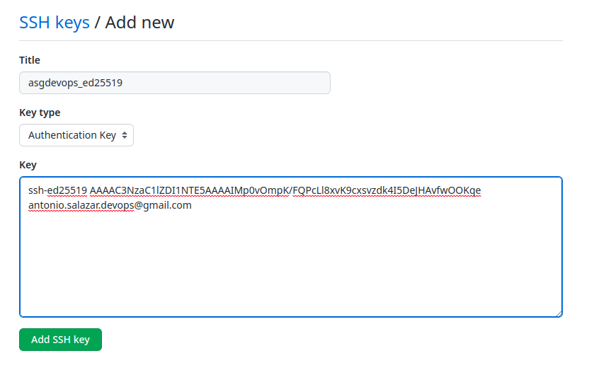
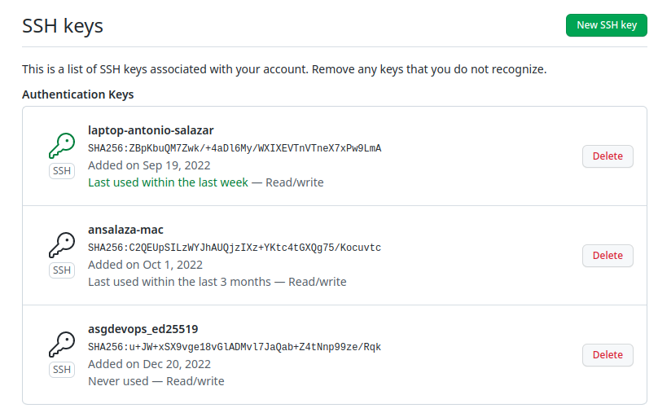

# :book: 7. SSH GitHub authentication

# Steps
1. Open a local terminal and run the command below.

    ```bash
    ssh-keygen -t ed25519 -C "your.email@ccount" -f ~/.ssh/ed25519
    ```

2. Enter a **passphrase** (_password_) and confirm that.

    

3. Verify a key pair files were created. 
   
   - The private key `~/.ssh/ed25519`
   
   - The public key `~/.ssh/ed25519.pub`

    ```bash
    ls -l ~/.ssh/ed25519*
    ```

    

4. Go to [GitHub](https://github.com/ ) 

5. Open the main menu and select **settings**.

    

5. Select the **SSH and GPG keys** option.

    

6. Click the **New SSH Key** button.

    

7. Back to your terminal, take the public key from `your terminal`

    ```bash
    cat ~/.ssh/ed25519.pub
    ```

    

8. Enter the **Title**, **Key type** and **Key**. (_paste the public key_)

    

9. Verify the SSH key was added to GitHub.

    

10. Switch back to your terminal and test the SSH Key connection to GitHub.


    ```bash
    ssh -i ~/.ssh/d25519 -T git@github.com
    ```

    - Where
      - `-i` tells SSH which key you are using.
      - `-T` means test.

    - Type the pasphrase used when the SSH key was created.

        

    - Now you are set.

<br />

# :books: References
- [Connecting to GitHub with SSH](https://docs.github.com/en/authentication/connecting-to-github-with-ssh)

<br />

:arrow_backward: [back to index](../README.md)
