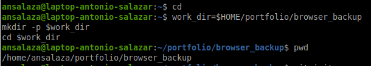
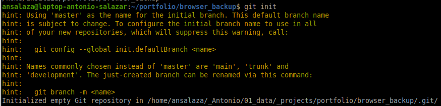
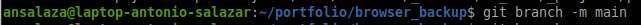
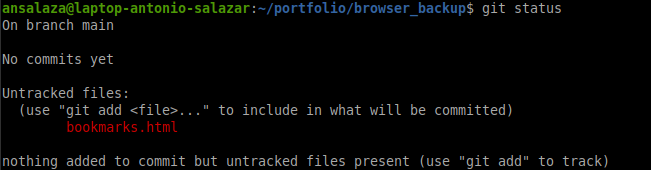
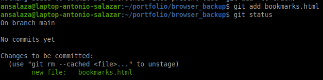
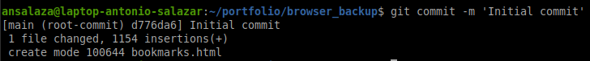
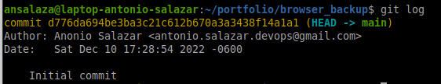

# 3. Creating a local repository

## Goal 
- Create a Git repository in your local machine.
- Create a new file and add it to the Git database.
- Verify the file version in Git.

## Steps

1. Create a new working directory.

    ```bash
    work_dir=$HOME/portfolio/browser_backup
    mkdir -p $work_dir
    cd $work_dir
    pwd
    ```

    

2. Initialize Git.

    ```bash
    git init
    ```

    

3. Rename the `master` branch to `main`

    ```bash
    git branch -m main
    ```

    

4. Export your favorites's browser bookmarks to the `$work_dir`. 

    _For standard convention, let us use the `bookmarks.html` as the exported file name._

   - [Exporting bookmarks from **Chrome**](https://support.google.com/chrome/thread/31505914?hl=en)
   
   - [Export **Firefox** bookmarks to an HTML file to back up or transfer bookmarks](https://support.mozilla.org/en-US/kb/export-firefox-bookmarks-to-backup-or-transfer)
   
   - [Exporting Bookmarks and Settings from **Opera** to Other Browsers](https://forums.opera.com/topic/40531/exporting-bookmarks-and-settings-from-opera-to-other-browsers)

    - [How do I EXPORT Bookmarks/Favorites from Microsoft **EDGE** Browser?](https://answers.microsoft.com/en-us/windows/forum/all/how-do-i-export-bookmarksfavorites-from-microsoft/1535cde2-68d5-4a31-9110-2bf334ab5dc6)

5. Create the initial Git `bookmarks.html` version.

   - Locate on the working dir.

    ```bash
    [ `pwd` != "$work_dir" ] && cd $work_dir
    ```

   - Review the change status.

    ```bash
    git status
    ```

    

   - Add the changes to the Staging Area.

    ```bash
    git add bookmarks.html
    ```

    

   - Commit the changes.

    ```bash
    git commit -m 'Initial commit'
    ```

    

6. Review the changes log.

    ```bash
    git log
    ```

    

<br />

:arrow_backward: [back](../03_creating_repositories.md)
