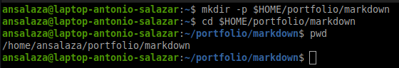
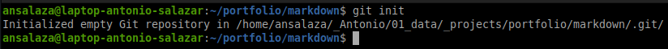
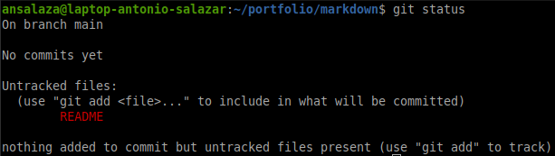
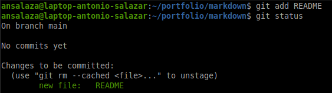
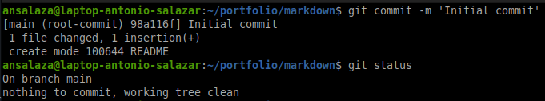
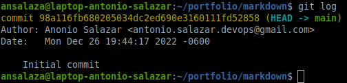

# :alembic: 3a. Create a Git repository

The purpose of the practice is to start building a markdown user guide using Git features.

## Goal 

- Create a Git repository in your local machine.
- Create a new file and add it to the Git database.
- Verify the file version in Git.

## Requisites
- [Install Git](../documents/01_installing_git.md) on your local computer.
- [Configure Git](../documents/02_configuring_git.md) before using it.

## Steps

1. **Create** a new working directory.

    ```bash
    mkdir -p $HOME/portfolio/markdown
    cd $HOME/portfolio/markdown
    pwd
    ```

    

2. **Initialize** Git database (_know as the local repository_).

    ```bash
    git init
    ```

    

3. **Edit** the `README` file in your <span style="color:red">working directory</span>.


    ```bash
    echo "# :book: Markdown User Guide" > README
    cat README
    ```

4. **Review** the change status.

    ```bash
    git status
    ```

    

5. **Add** the changes to the <span style="color:green">Staging Area</span>. 

    ```bash
    git add README
    ```

    

6. **Save** the changes to <span style="color:gold">Git repository</span> (_database_).

    ```bash
    git commit -m 'Initial commit'
    ```

    

7. **Review** the changes log.

    ```bash
    git log
    ```
    


    > Notice the change record is identified by SHA-1 code `98a116fb680205034dc2ed690e3160111fd52858`.


# :books: References
- [Git Basics - Getting a Git Repository](https://git-scm.com/book/en/v2/Git-Basics-Getting-a-Git-Repository) 
 
<br />

:arrow_backward: [back to index](../README)
