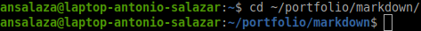
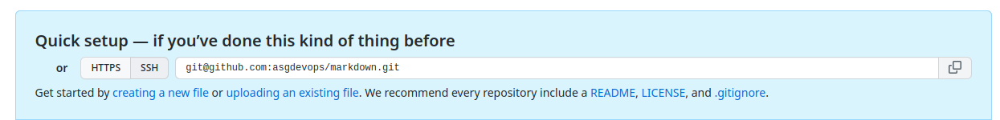
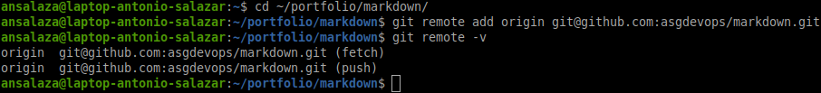
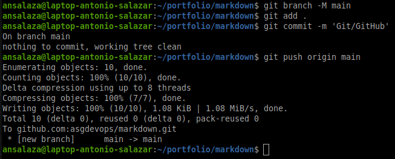
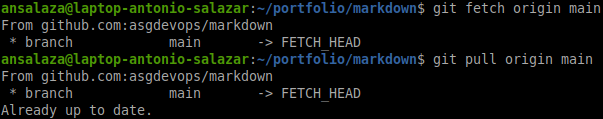
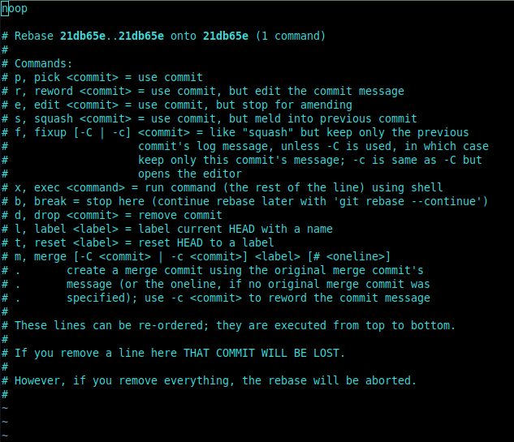
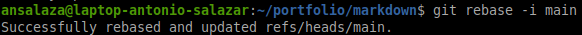

# :alembic: 3c. Synchronize repositories

## Goal 
- Update the information from the local Git repository to the GitHub remote one.

## Requisites
- [Create a Git (local) repository](../labs/lab_03a_creating_a_git_repository.md)
- [Create a GitHub (remote) repository](../labs/lab_03b_creating_a_github_repository.md)


#  Steps

1. Configure the [SSH GitHub Authentication](../documents/07_ssh_github_authentication.md). 

2. Open a terminal a go to your local repository

    ```bash
    cd ~/portfolio/markdown
    ```

    ||
    |:--:|
    ||
    |Fig 1. Local repository|

3. On GitHub copy the GitHub SSH address line and paste it onto your local terminal.

    ```bash
    git remote add origin git@github.com:asgdevops/markdown.git
    ```

    ||
    |:--:|
    ||
    |Fig 2. Copy GitHub SSH address line|

4. Verify the remote repository has been setup properly.

    ```
    git remote -v
    ```

    ||
    |:--:|
    ||
    |Fig 3. Setup remote repository|

5. Rename your main branch (optional)

    ```
    git branch -M main
    ```

6. Syncronize any changes

    - Update your Git database (tree)

    ```
    git add .
    git commit -m 'Git/GitHub'
    ```

    - Push any changes

    ```
    git push -u origin main
    ```

    ||
    |:--:|
    ||
    |Fig 4. Git push|

    - Take the HEAD up to the latest update (edge) on your local repository.

    - Pull the latest updates from GitHub.
        
        ```bash
        git fetch origin main
        git pull origin main
        ```

        ||
        |:--:|
        ||
        |Fig 5. Git pull|

    - Exeute a Git Rebase to take the HEADER pointer to the latest update.

        ```bash
        git rebase -i main 
        ```

        ||
        |:--:|
        ||
        |Fig 6. Git rebase|

        - Save when prompted [`ESC` + `:` + `x`]
        
        ||
        |:--:|
        ||
        |Fig 7. Rebase save|

<br/>

# :books: References
- [git push](https://git-scm.com/docs/git-push)
- [git fetch](https://git-scm.com/docs/git-fetch)
- [git pull](https://git-scm.com/docs/git-pull)
- [git rebase](https://git-scm.com/docs/git-fetch)

:arrow_backward: [back to index](../README.md#00-toc)