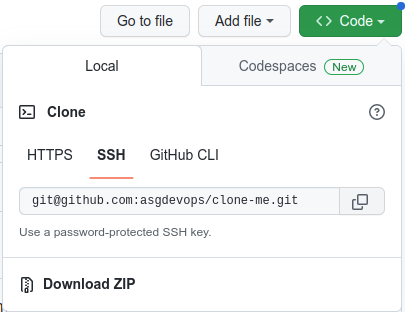
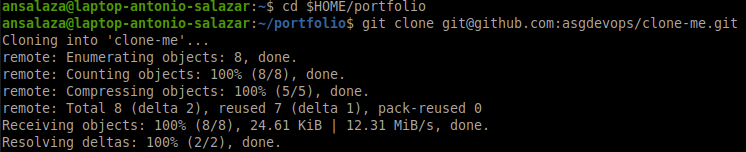
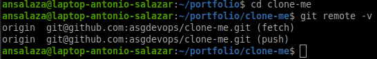

# :alembic: 3c. Cloning a repository

## Goal 
- Clone an existing repository from GitHub onto your local machine.

#  Steps

1. Go to the [asgdevops/clone-me](https://github.com/asgdevops/clone-me) **github** repository.

2. Take the git repository name from the SSH code `git@github.com:asgdevops/clone-me.git` tab.

    

3. In your local machine open a new ssh terminal and go to the directory where you would like to drop the cloned repository.


    ```bash
    cd $HOME/portfolio
    ```

4. Issue the `git clone` repository command.

    ```bash
    git clone git@github.com:asgdevops/clone-me.git
    ```
    
    

5. Get in the cloned directory.

    ```bash
    cd clone-me
    ```

6. Verify the cloned directory is configured properly.

    ```bash
    git remote -v
    ```

    

<br/>

# :books: References
- [**Git clone** command official documentation](https://git-scm.com/docs/git-clone)

:arrow_backward: [back to index](../README.md#00-toc)