# :alembic: 4. Record Changes in Git

The objective is to continue to build the markdown user guide, started in the previous chapter.

## Goal 

- Create a new file named `author.txt` and add it to the Git database.
- Append the topic skeleton to the `README` file.
- Update the author name in the `author.txt` file.
- Stage `README` and `author.txt` files.
- Compare the Working Tree file versions.
- Submit all of the changes to the Git Repository.

## Requisites
- [Install Git](../documents/01_installing_git.md) on your local computer.
- [Configure Git](../documents/02_configuring_git.md) before using it.
- [Create a repository in Git](../documents/03_creating_a_repository_in_git.md).

## Steps

### :red_circle: Create a new file named `author.txt` and add it to the Git database.

1. **Verify** the Git Working Tree status.

    ```bash
    git status
    ```

    

2. **Create** the `author.txt` file.

    ```bash
    echo -e "Author: $USER\nUpdated on: $(date +%Y-%m-%d)" > author.txt
    cat author.txt
    ```

    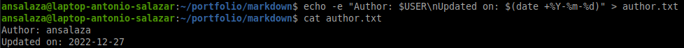

3. **Verify** the Git Working Tree status.

    ```bash
    git status
    ```

    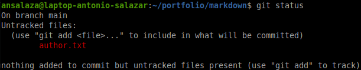


4. **Stage** the `author.txt` file.

    ```bash
    git add author.txt
    git status
    ```

    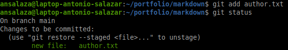


5. **Commit** the changes.

    ```bash
    git commit -m 'Add author username and update date.'
    ```
    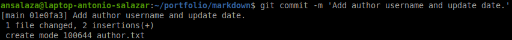

6. **Review** the status again..

    ```bash
    git status
    ```

    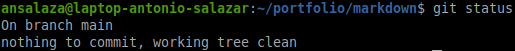

7. **Verify** the log history.

    ```bash
    git log
    ```

    

### :red_circle: Append the topic skeleton to the `README` file.

8. **Edit** the `README` file with any editor of your preference.

    ```md
    ## What is Markdown?
    ## What is Markdown used for?

    # Markdown syntax
    ## Headers

    ## Text formats

    ## Lists

    ## Tables and horizontal rules

    ## Links

    ## Images and Emoji

    ## Foot notes

    ## Markdown eidtors

    # References
    ```

    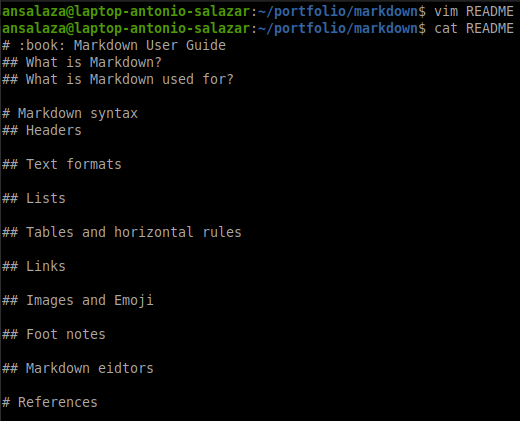

### :red_circle: Update the author name in the `author.txt` file.

9. **Replace** the author's name to the ``author.txt` file.

    ```bash
    NAME=`git config --get user.name`
    sed "s/$USER/$NAME/g" author.txt > author.new
    mv author.new author.txt
    ```

    

10. **Verify** the Git working tree status.

    ```bash
    git status
    ```

    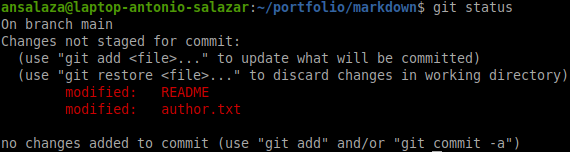

### :red_circle: Stage `README` and `author.txt` files.

11. **Add** both files to the Git Staging Area.


    ```bash
    git add .
    ```

    _The dot at the end means to stage every modified file or directory._

12. **Verify** the files are now staged.

    ```bash
    git status
    ```

    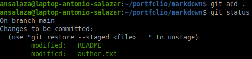    

### :red_circle: Compare the Working Tree file versions.

13. **Modify** the `author.txt` file by adding the email address.

    ```bash
    EMAIL=`git config --get user.email`
    echo $EMAIL
    echo $EMAIL >> author.txt
    cat author.txt
    ```

    

    View the current status.

    ```bash
    git status
    ```
    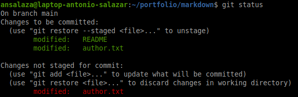

14. **Compare** the differences of `author.txt` file between the Staging Area and the Working Directory.

    ```bash
    git diff
    ```

     


15. Now **compare** between the Git Repository against the Staging Area.

    ```bash
    git diff --staged
    ```

    


### :red_circle: Submit all of the changes to the Git Repository.

16. **Stage** the `author.txt` file.

    ```bash
    git status
    git add author.txt
    git status
    ```

    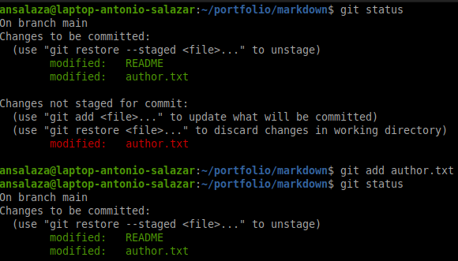

17. **Commit** both the `README` and the `author.txt` files. This time use `git commit -a`.

    ```bash
    git commit -a # hit enter
    ```

    

    Edit the comments and save them.

    

18. **Check** the Git Repository log history.

    ```bash
    git commit -a # hit enter
    ```

    


19. **Compare** the Initial commit against the second one.


    ```bash
    git diff 98a116 01e0f
    ```

    


20. **Compare** the Second commit with the third one.

    ```bash
    git diff 01e0fa 21db65
    ```

    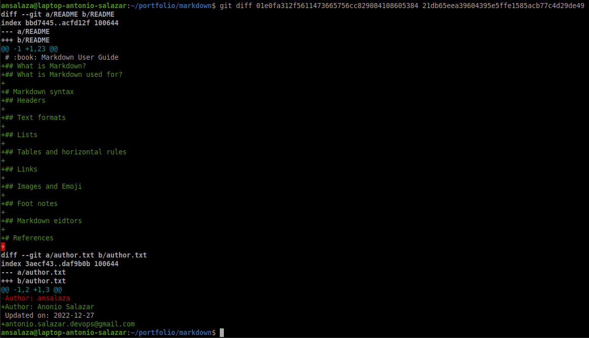

# :books: References
- [Git Basics - Getting a Git Repository](https://git-scm.com/book/en/v2/Git-Basics-Getting-a-Git-Repository) 
 
<br />

:arrow_backward: [back to index](../README)
