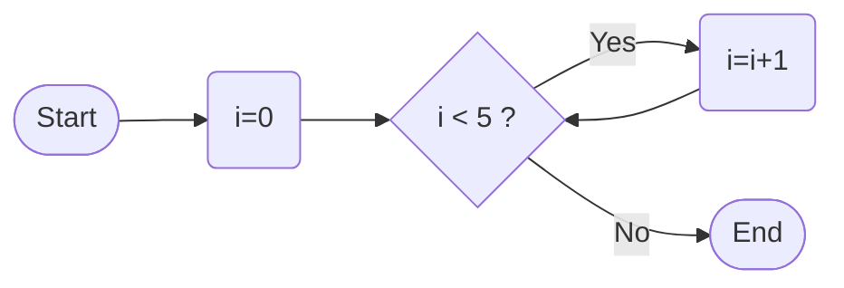
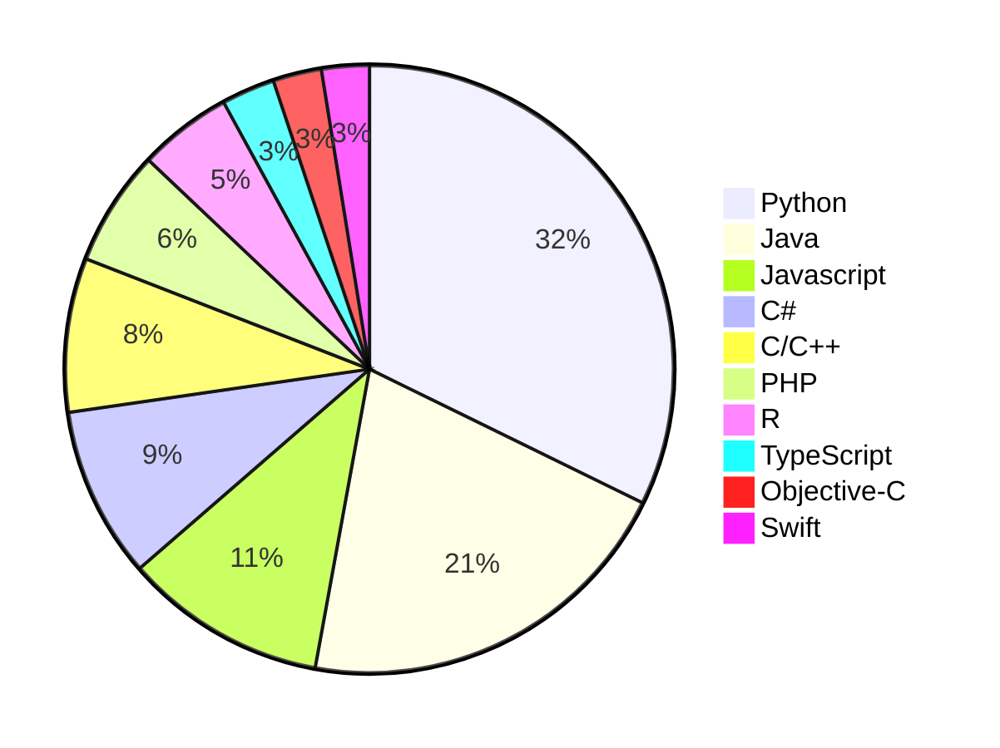

# Charts and Diagrams

The charts and diagrams are possible due to [mermaid](https://mermaid.js.org/) technology.

Ro start using mermaid, place your code between the block code tags specifying you are working with mermaid languate.

For example:</br>
\`\`\`mermaid</br>
your code</br>
\`\`\`</br>


## Examples
---

## Flow chart

**Left to right flow**


**Syntax**

```text


---

<table>
<tr>
  <td> 
  
  **Top to down flow** 
  
  </td>
  <td>
  
  **Syntax**

  </td>
</tr>
  <td> 
  
  ```mermaid
  ---
  Title: Increment 2
  ---
  flowchart TD
    A([Start]) 
    B(i=0) 
    C{i < 5 ?}
    D(i+=)
    E([End])
    A-->B-->C
    C-->|Yes| D
    C-->|No| E
    D-->C
  ```  
  
  </td>
  <td>
  
  ```text
  ```mermaid
  ---
  Title: Increment 2
  ---
  flowchart TD
    A([Start]) 
    B(i=0) 
    C{i < 5 ?}
    D(i+=)
    E([End])
    A-->B-->C
    C-->|Yes| D
    C-->|No| E
    D-->C
  ```  

  </td>
</tr>
</table>


## Pie Chart



**Syntax**

```text
---
Title: Top 10 programming languages 2022 PYPL Index (Worldwide)
---
pie
"Python" : 27.61
"Java" :  17.64
"Javascript" :  9.21
"C#" : 7.79
"C/C++" : 7.01
"PHP" : 5.27
"R" : 4.26
"TypeScript" : 2.43
"Objective-C" : 2.21
"Swift" : 2.17
```

# :books: References
- [A Mermaid User-Guide for Beginners](https://mermaid.js.org/intro/n00b-gettingStarted.html#a-mermaid-user-guide-for-beginners)
- [Top Computer Languages](https://statisticstimes.com/tech/top-computer-languages.php)